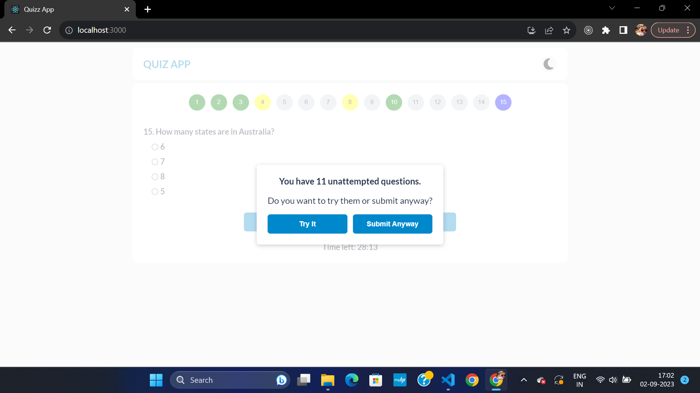

# QUIZ APP

The Quiz App is a web application designed to create a seamless quiz experience for users. It encompasses the following key features and functionalities:

## Table of Contents

- [Installation](#installation)
- [Usage](#usage)
- [Screenshots](#screenshots)
- [Techstack](#techstack)
- [Badges](#badges)
- [Contact](#contact)

## Installation

To run this project locally, follow these steps:

1. **Clone the Repository**

   Clone this repository to your local machine using the following command:

   ```bash
   git clone https://github.com/Priyajha017/quizz.git

2. **Navigate to the Project Directory**

   Open your terminal or command prompt and change the current directory to the project's folder:

   ```bash
   cd quizz

3. **Install Dependencies**

   Install the project dependencies using npm (Node Package Manager). Make sure you have Node.js and npm installed on your system:

   ```bash
   npm install

4. **Start the Development Server**

   Once the dependencies are installed, you can start the development server to run the application locally:

   ```bash
   npm start

5. **Access the Application**

   Open your web browser and go to http://localhost:3000 to access the running application.


## Usage

This React quiz application guides users through a quiz-taking experience. Here's how to use it:

1. **Start Page**:
   - When the server starts, the user is automatically directed to the start page.
   - The user is prompted to enter their valid email address.

2. **Quiz Questions**:
   - After entering a valid email address, the application will display a total of 15 quiz questions.
   - Users can navigate between questions using the "Next" and "Previous" buttons.
   - Additionally, users can jump to any specific question using the "Overview" button panel.

3. **Question Status Indicators**:
   - To provide a clear overview of question status:
     - The currently selected question button will appear in blue.
     - Questions that have been visited but not attempted will be highlighted in yellow.
     - Questions that have been attempted will be highlighted in green.

4. **Quiz Submission**:
   - Once the user has answered all 15 questions or the timer reaches zero, the quiz will automatically submit.

5. **Report Page**:
   - After completing the quiz (or when the timer ends), users are directed to the report page.
   - The report page displays each question along with the user's answer and the correct answer side by side for easy comparison.

6. **Handling Unattempted Questions**:
   - If there are unattempted questions when submitting the quiz, a modal will appear.
   - The modal will ask if the user would like to try answering the remaining questions or proceed with the submission.

7. **User can switch between light and dark theme**:
    - In header there is theme toggle button, using which user can switch theme

Enjoy using the React quiz application! Feel free to customize it further to meet your specific needs.

### Screenshots
**1. Start-page**


**2. Quiz page**

**3. Confirmation modal**

**4. Report page**

### Techstack
<br/>

* 
* 
* 
* 
* 
* 
* 

## Contact

[](priyajha7585@gmail.com)
[](https://www.linkedin.com/in/priyajha7585/)
[](https://github.com/Priyajha7585)